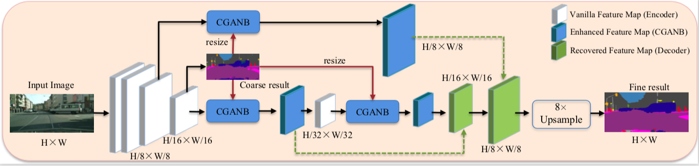

# CGAN-Net 
[CLASS-GUIDED ASYMMETRIC NON-LOCAL NETWORK FOR REAL-TIME SEMANTIC SEGMENTATION](https://ieeexplore.ieee.org/abstract/document/9414957) (ICASSP, 2021)

## Abstract
By introducing various non-local blocks to capture the long-range dependencies, remarkable progress has been achieved in semantic segmentation recently. However, the improvement in segmentation accuracy usually comes at the price of significant reductions in network efficiency, as non-local block usually requires expensive computation and memory cost for dense pixel-to-pixel correlation. In this paper, we introduce a Class-Guided Asymmetric Non-local Network (CGAN-Net) to enhance the class-discriminability in learned feature map, while maintaining real-time efficiency. The key to our approach is to calculate the dense similarity matrix in coarse semantic prediction maps, instead of the high-dimensional latent feature map. This is not only computationally and memory efficient, but helps to learn query-dependent global context. Experiments conducted on Cityscape and CamVid demonstrate the compelling performance of our CGAN-Net. In particular, our network achieves 76.8% mean IoU on the Cityscapes test set with a speed of 38 FPS for 1024×2048 images on a single Tesla V100 GPU.

## Model

